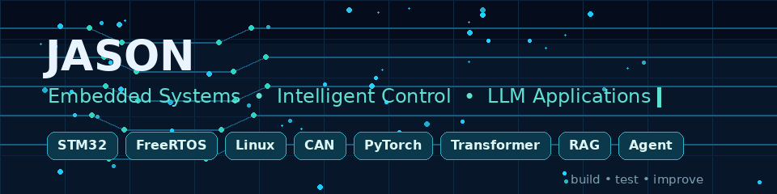

<p align="center">
  
</p>

<h1 align="center">Hi, I'm Jason 👋</h1>

<p align="center">
  <strong>Electronic Information Engineering Student @ HIT, Weihai</strong><br/>
  Embedded Systems · Intelligent Control · LLM Applications
</p>

<p align="center">
  
  
  
</p>

你好，我是 Jason，目前就读于 **哈尔滨工业大学（威海）电子信息工程专业**。

我的主要方向是 **嵌入式系统与智能装备开发**，目前正在学习和实践 STM32、FreeRTOS、自动控制、工业通信与嵌入式 Linux。

与此同时，我也在独立学习 **互联网大语言模型与 AI 应用开发**，包括 Transformer、Hugging Face、大模型 API、RAG、Agent、LoRA 微调与本地模型部署。

> Exploring embedded systems from device drivers to intelligent control,  
> while building practical LLM applications with Transformers, RAG and Agents.

---

## 🎓 Education

### Harbin Institute of Technology, Weihai

**哈尔滨工业大学（威海）｜电子信息工程本科**

- 📡 专业方向：通信与嵌入式系统
- 🔧 技术兴趣：BSP、设备驱动、FreeRTOS 与嵌入式 Linux
- 🎛️ 应用方向：自动控制、工业通信与智能无人装备
- 🧠 拓展方向：Transformer、RAG、Agent 与 LLM 应用开发

---

## 🔭 Current Focus

### Embedded Systems

- 🔧 STM32 BSP 与设备驱动基础
- ⚙️ FreeRTOS 实时系统设计
- 🎛️ 电机控制、航向控制与路径跟踪
- 📡 CAN、RS485、Modbus 与 MQTT
- 🐧 嵌入式 Linux 应用与边缘网关
- 🚤 智能无人船与双节点协同系统

### Large Language Models

- 🧠 PyTorch 与深度学习基础
- 🧩 Transformer 与 GPT 原理
- 🤗 Hugging Face 模型应用
- 💬 大模型 API 与结构化输出
- 📚 RAG 文档知识库
- 🛠️ Agent 与工具调用
- 🚀 LoRA 微调与本地模型部署

---

## 🧭 Learning Paths

### Embedded Systems

```text
C / STM32
    ↓
BSP & Device Drivers
    ↓
FreeRTOS
    ↓
Motor & Control Systems
    ↓
CAN / RS485 / Modbus
    ↓
Embedded Linux
    ↓
Intelligent Equipment
```

### Large Language Models

```text
Python / PyTorch
    ↓
NLP Fundamentals
    ↓
Transformer & GPT
    ↓
Hugging Face
    ↓
LLM API Development
    ↓
RAG & Agents
    ↓
Fine-tuning & Deployment
```

---

## 📈 Project Progress

| 项目 | 技术方向 | 当前进展 | 状态 |
|---|---|---|---|
| Python Engineering Toolkit | Python 工程 | 已完成数据处理、文件操作与常用脚本整理 | ✅ 已完成 |
| Autonomous Boat System | 智能装备 | 已完成传感器、推进控制与网页监测平台的基础集成 | ✅ 已完成 |
| Digital Communication Lab | 通信算法 | 正在完善 CRC、曼彻斯特编码、调制解调与误码率仿真 | 🟡 进行中 |
| Mini Transformer Lab | LLM 原理 | 已完成 Mini GPT-2 配置与模型结构实验，正在继续学习 Transformer | 🟡 进行中 |
| STM32 BSP Drivers | BSP 与驱动 | 计划整理统一驱动接口、错误码、超时处理与测试记录 | ⚪ 待开发 |
| FreeRTOS Control Node | 实时系统 | 计划实现采集、控制、通信、安全保护与日志任务 | ⚪ 待开发 |
| Industrial Device Network | 工业通信 | 计划实现 CAN、RS485、Modbus、心跳与异常恢复机制 | ⚪ 待开发 |
| Linux Edge Gateway | 嵌入式 Linux | 计划实现设备接入、数据存储、MQTT 与 Web API | ⚪ 待开发 |
| LLM API Playground | LLM 应用 | 计划实现多模型切换、流式输出、结构化输出与工具调用 | ⚪ 待开发 |
| RAG Knowledge Assistant | LLM 应用 | 计划实现技术文档检索、知识问答与来源引用 | ⚪ 待开发 |

> 仅将已经存在代码或正在实际推进的项目标记为“进行中”；尚未建立仓库或尚未开始编码的项目统一标记为“待开发”。

---

## 🎯 Featured Projects

### 🐍 Python Engineering Toolkit · Completed

用于日常学习与工程实践的 Python 工具集合，包含数据处理、文件操作、脚本自动化与常用功能模块。

`Python` `NumPy` `Pandas` `Matplotlib`

---

### 🚤 Autonomous Boat System · Completed

面向水域检测与竞赛展示的无人船系统，完成传感器数据接入、推进控制、状态监测与网页可视化的基础集成。

`STM32` `ESP32` `Sensors` `Motor Control` `Next.js`

---

### 📡 Digital Communication Lab · In Progress

数字通信系统仿真实验平台，正在实现 CRC、曼彻斯特编码、调制解调、信道模拟、星座图与误码率分析。

`Python` `NumPy` `Matplotlib` `Digital Communication`

---

### 🧠 Mini Transformer Lab · In Progress

从 Mini GPT-2 配置与模型结构实验开始，逐步理解 Tokenizer、Embedding、Self-Attention、Transformer Block 与文本生成。

`Python` `PyTorch` `Transformer` `NLP`

---

## 🧪 Planned Projects

### 🔧 STM32 BSP Drivers

面向传感器与执行机构的 STM32 驱动库，计划加入统一接口、错误码、超时、自检与故障恢复机制。

### ⚙️ FreeRTOS Control Node

基于 FreeRTOS 的实时控制节点，计划拆分传感器、控制、通信、安全保护与日志任务。

### 📡 Industrial Device Network

基于 CAN、RS485 和 Modbus 的多设备通信系统，计划支持心跳、CRC、超时检测、指令应答与异常恢复。

### 🐧 Linux Edge Gateway

运行于 Linux 开发板的边缘网关，计划负责设备接入、数据存储、MQTT 通信与 Web API。

### 💬 LLM API Playground

计划实现多模型 API 接入、流式输出、对话历史、结构化输出与工具调用。

### 📚 RAG Knowledge Assistant

计划构建面向课程资料和技术文档的 RAG 知识库，实现检索问答与来源引用。

---

## 🛠️ Tech Stack

### Embedded · Control · Communication

<p>
  
</p>

<p>
  
  
  
  
  
  
  
  
</p>

### LLM · AI · Data

<p>
  
</p>

<p>
  
  
  
  
  
  
</p>

### Web · Backend · Development Tools

<p>
  
</p>

> 图标表示正在使用、已有项目经验或正在学习，不等同于全部精通。

---

## ✨ Beyond Coding

喜欢把复杂的技术路线拆解成一个个可以运行、测试和持续改进的小项目。

一边和传感器、电机、开发板打交道，  
一边研究模型为什么能够理解和生成语言。

偶尔摸鱼，持续升级。 🚀
